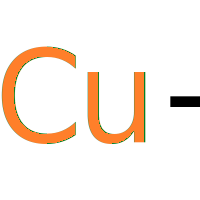

 **Open, Connected and Decentralized** commodity maket based on a social network. 

Copper-plus project came up with the intention of improve local commodity market by introducing an experimental social network type technical solutions.

### OVERVIEWS

Supply chain management in the commodity market, a broad area that has such business opportunities when we consider the grey areas. If we narrowed down our scope into the agri supply chain in Sri Lanka, that was a less systematic and hidden market. Initially Copper-plus came up as a solution in this point with the nature of open and decentralization. It’s a dedicated decentralized social network for agri supply chain management and experiment beginning from Sri Lanka.

Sri Lankan agri product supply chain doesn’t have proper mechanisms and peoples  are facing such difficulties due to these less systematic behaviors. Especially within this covid situation this problem becomes worse. Food product vendors didn’t get sufficient income, vendor to customer distance with number of middle brokers, demand and supply mismatch, less support for commercial home farming and small level vendors some key problems that we recognized in this problematic agri supply chain. When we move forward with this market analysis, we identified that open market, opportunities for small and medium vendors and direct communication on open platforms are some key strong suggestions above matters. Copper-plus keep focus on these actual use cases to make more reliable and practical solutions. 

